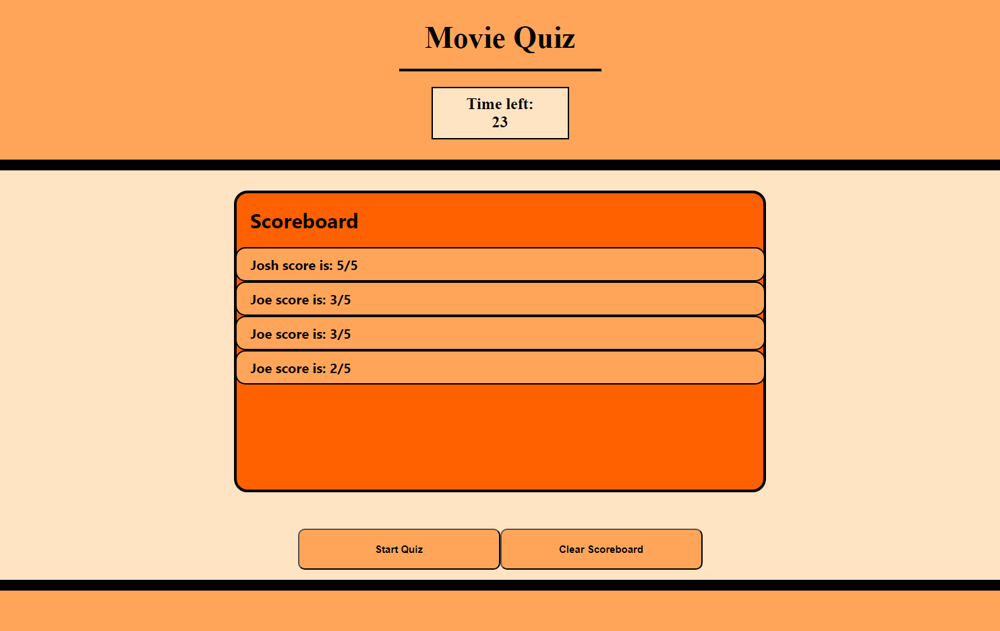

# movie-quiz

- created by Joshua Martinez

## Your Task

Creating a movie quiz webpage, that is able to keep and remove score

## User Story

```
- AS A coding boot camp student
- I WANT to take a timed quiz on JavaScript fundamentals that stores high scores
- SO THAT I can gauge my progress compared to my peers

```

## Acceptance Criteria

```
- GIVEN I am taking a code quiz
- WHEN I click the start button
- THEN a timer starts and I am presented with a question
- WHEN I answer a question
- THEN I am presented with another question
- WHEN I answer a question incorrectly
- THEN time is subtracted from the clock
- WHEN all questions are answered or the timer reaches 0
- THEN the game is over
- WHEN the game is over
- THEN I can save my initials and score

```

## Mock-Up

The following image shows the web application's appearance and functionality:



## Assets

- deployed site: https://xjoshm1014.github.io/movie-quiz/
- img folder
- html
- css
- javascript

---

© 2023 edX Boot Camps LLC. Confidential and Proprietary. All Rights Reserved.
